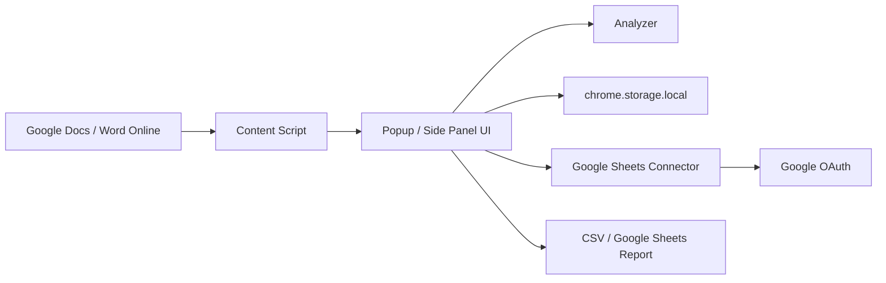

# Архитектура расширения

## Цель

Расширение помогает SEO-редактору проверять текст в Google Docs и позже в Word Online: считает вхождения ключей, сравнивает с нормой, показывает проблемы, подсвечивает совпадения и экспортирует отчет.

## Общая схема



## Модули

### 1. UI

Файлы MVP:

- `popup.html`
- `styles.css`
- `popup.js`

Задачи:

- вкладки Summary, Keywords, Issues, Settings;
- ручной ввод ключей;
- запуск проверки;
- сохранение настроек в `chrome.storage.local`;
- отправка команд content script;
- экспорт CSV.

В продакшн-версии UI лучше перенести в Side Panel API, потому что SEO-редактору удобнее держать отчет справа от документа.

### 2. Content Script

Файл MVP:

- `content.js`

Задачи:

- получить текст открытого документа;
- вернуть заголовок и URL документа;
- подсветить найденные ключи;
- перейти к следующему вхождению.

MVP использует DOM-парсинг и CSS Highlight API. Это не портит документ: подсветка живет только в браузерном слое и исчезает после очистки или перезагрузки.

### 3. Analyzer

Файл MVP:

- `analyzer.js`

Задачи:

- парсинг ручного списка ключей;
- подсчет символов, СБП и слов;
- exact match;
- broad match начального уровня;
- защита от совпадений внутри слова;
- плотность ключей;
- статусы;
- список issues.

Analyzer должен оставаться чистым модулем без зависимости от Chrome API. Тогда его легко покрыть тестами и переиспользовать в backend.

### 4. Storage

MVP:

- `chrome.storage.local`

Хранит:

- ручной список ключей;
- настройки поиска;
- целевой объем текста.

Версия 2:

- проекты;
- маппинг колонок Google Sheets;
- последние выбранные листы;
- цветовую схему подсветки;
- игнорируемые ключи.

### 5. Google Sheets Connector

Версия 2.

Задачи:

- OAuth через `chrome.identity`;
- чтение таблицы по URL;
- выбор листа;
- маппинг колонок;
- нормализация строк в структуру `KeywordRule`;
- сохранение проекта.

### 6. Document Connector

Для Google Docs есть два уровня:

1. DOM/live layer: видимая подсветка, переходы, чтение части видимого текста.
2. Google Docs API: полный текст документа, структура параграфов и заголовков.

Для точного анализа лучше получать полный текст через API, а DOM использовать как слой навигации.

Word Online лучше добавлять отдельным connector-модулем, потому что DOM и модель документа отличаются от Google Docs.

## Структура данных

### KeywordRule

```ts
type KeywordType = "primary" | "secondary" | "faq" | "forbidden";

type KeywordRule = {
  id: string;
  keyword: string;
  min: number | null;
  max: number | null;
  type: KeywordType;
  comment: string;
};
```

### KeywordResult

```ts
type KeywordResult = KeywordRule & {
  found: number;
  status: "OK" | "Missing" | "Low" | "Overused" | "Forbidden" | "Not tracked";
  density: number;
  requiredLabel: string;
};
```

### ProjectConfig

```ts
type ProjectConfig = {
  id: string;
  name: string;
  sheetUrl: string;
  sheetName: string;
  pageColumn: string;
  keywordColumn: string;
  minColumn?: string;
  maxColumn?: string;
  volumeColumn?: string;
  commentColumn?: string;
  headingColumn?: string;
  forbiddenColumn?: string;
};
```

### DocumentSnapshot

```ts
type DocumentSnapshot = {
  title: string;
  url: string;
  text: string;
  blocks: Array<{
    type: "paragraph" | "h1" | "h2" | "h3" | "h4";
    text: string;
    index: number;
  }>;
};
```

## UX-логика

### Ручной режим

1. Пользователь открывает Google Docs.
2. Открывает расширение.
3. В Settings вставляет ключи.
4. Указывает настройки match mode и объем текста.
5. Нажимает `Проверить`.
6. Summary показывает общую картину.
7. Keywords показывает таблицу и действия.
8. Issues показывает проблемы.
9. Пользователь включает подсветку или переходит к вхождению.

### Google Sheets режим

1. Пользователь вставляет ссылку на Google Sheet.
2. Расширение просит OAuth-доступ.
3. Пользователь выбирает лист.
4. Расширение предлагает сопоставить колонки.
5. Конфиг сохраняется как проект.
6. Расширение определяет страницу по title/URL/ручному выбору.
7. Загружает ключи и структуру только для этой страницы.
8. Запускает анализ.

### Статусы

- `OK`: ключ уложился в норму.
- `Missing`: ключ нужен, но не найден.
- `Low`: найден, но меньше минимума.
- `Overused`: найден больше максимума.
- `Forbidden`: запрещенный ключ найден.
- `Not tracked`: ключ отслеживается, но норма не задана.

## Проверка заголовков

Версия 2 должна хранить ожидаемые заголовки как список:

```ts
type HeadingRule = {
  level: 1 | 2 | 3 | 4;
  text: string;
  required: boolean;
};
```

Проверки:

- нет H1;
- больше одного H1;
- пустые заголовки;
- отсутствующие заголовки;
- лишние заголовки;
- похожие, но отличающиеся заголовки;
- H3 без предыдущего H2;
- H4 без предыдущего H3;
- основной ключ отсутствует в H1.

## Производительность

- Анализ текста выполнять в popup или offscreen worker.
- Для больших документов кешировать snapshot и пересчитывать только после ручного запуска.
- Подсветку ограничивать выбранными ключами или текущим viewport.
- Не делать постоянный polling Google Docs DOM.
- Для Google Sheets сохранять нормализованные данные проекта в storage.
